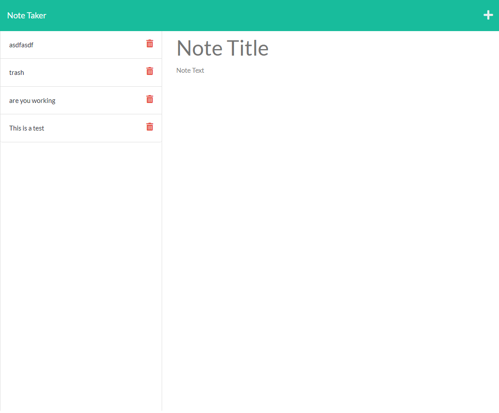

# Note Taker

[](https://opensource.org/licenses/MIT)

## Description

This program allows you to write notes and store them so they are persistant. You can save your note and then it will appear on the left hand side of the screen. You can click on old notes to access them again or click on the trash can icon to delete a note.

## Table of Contents (Optional)

- [Installation](#installation)
- [Usage](#usage)
- [Questions](#questions)

## Installation

To install necessary depenencies, run the follwing command:

```md
npm i
```

## Usage

To use it, write in the input field, save. Then you can choose to delete notes.

https://shielded-eyrie-68522.herokuapp.com/notes



## How to Contribute

Feel free to contribute!

## Tests

npm test

## Questions?

Reach out to me!

-GitHub: [HeyItsKito](https://github.com/HeyItsKito)

-Email: bradleyrodriguez77@gmail.com
